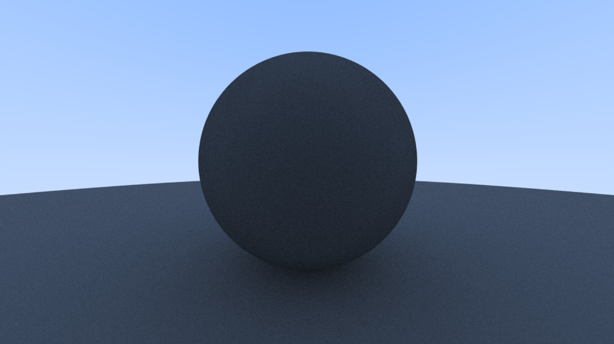

# RT-In-One-WeekEnd
Raytracing in one weekend cause I hate myself.

This is a repository created to learn Raytracing by writting a CPU pathtracer. This serves as a learning excercise
for me to learn this gorgeous tech that I'd like to implement at somepoint in Mikoto this year.

Main learning resource is the [Ray Tracing in one Weekend](https://raytracing.github.io/) set of articles, after finishing those
the plan is to move to hardware accelerated with Vulkan Raytracing and DXR as Mikoto also supports both.

## Source
- Title (series): “Ray Tracing in One Weekend Series”
- Title (book): “Ray Tracing in One Weekend”
- Author: Peter Shirley, Trevor David Black, Steve Hollasch
- Version/Edition: v4.0.2
- Date: 2025-04-25
- URL (series): https://raytracing.github.io
- URL (book): https://raytracing.github.io/books/raytracinginoneweekend.html